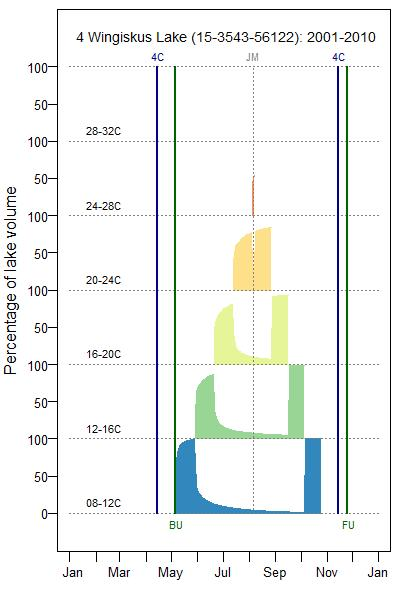

# Tutorial for using the `thermopic` package

```{r, echo=FALSE}
library(thermopic)
```

## Introduction

A ThermoPic is a picture of thermal habitat in a lake.  Given that the seasonal temperature cycle is known or can be predicted  (Figure 1), one can calculate for each day of the year how much habitat exists within specified bands of temperature (e.g., 8-12 °C, 12-16 °C, 16-20 °C, etc.).  A ThermoPic can then be produced by plotting % volume (or area) of habitat versus day of year  (Figure 2).  Because fish species differ in terms their preferred temperatures, this plot is a very useful summary of the thermal habitat available for different species.
The ThermoPic software serves three purposes.  First, it predicts the seasonal temperature cycle in lakes based on easily measured variables (i.e., lake morphometry and climate).  Second, it calculates and reports thermal habitat statistics.  Third, it generates a ThermoPic plot.  The model used to predict temperature is referred to as the Seasonal Temperature Model (STM).  It was created by Minns et al. (2016) based on data from lakes in the province of Ontario (Canada).   The STM is based on seven parameters (see Figure 3), each of which can be predicted given the following lake data inputs:  location (latitude, longitude, elevation), morphometry (surface area, shoreline length,  maximum depth and mean depth),  water chemistry (Secchi, DOC), air temperature cycle (monthly means), and precipitation in August.  Formulae used to calculate the STM parameters are given in this Guide, including formulae for dealing with missing data (i.e., Secchi, DOC, Shoreline).

Figure C1.  Seasonal temperature cycle in a lake.

Figure C2.  Example of a ThermoPic

Figure C3.  The Seasonal Temperature Model (STM) parameters.
C2.  Installation

## Installation

Installation instructions may be found online at https://github.com/stevencarlislewalker/thermopic/blob/master/README.md.  At the time of writing these instructions involve the following steps:
    1.	Open an R session
    2.	Make sure you are connected to the internet
    3.	If the devtools package is not already installed, install it by entering the following command into the R prompt:  install.packages(‘devtools’)
    4.	Install the thermopic package by entering the following command into the R prompt:  devtools::install_github(‘stevencarlislewalker/thermopic’)

To begin using the thermopic package, enter the following command into the R prompt:  library(thermopic)


## Operation

The thermopic R package provides functions for creating and modifying a project directory with a particular structure. The setup_directory function automatically imposes this structure on a chosen directory and populates it with CSV files to be used as input.  The thermopic_model and thermopic_report functions modify and create files within this structure and produces JPEG or TIFF files of ThermoPic plots.  Once all three functions are called, the project directory structure will look something like this:

```{r, echo=FALSE}
print_directory_tree('../misc/tutorial_project')
```

The `DataIn` directory contains three csv files that provide the input data to the project. 

consists of:
    * a data dictionary (ThermoPic_Dictionary.csv)
    * 3 CSV data input files (0_User_Options, 1_Lake, 2_Climate)
    * 3 CSV output files (3_Model_Inputs, 4_STM_Parameters, 5_Thermal Space4D)
    * multiple JPEG files (one for each ThermoPic created)

The data dictionary is stored in a main folder for reference, and two sub-Folders (DataIn, DataOut), as illustrated below.  ThermoPic plots are stored as JPEG or TIFF files in a sub-folder of DataOut.  

The main folder also includes supplementary information:
    * ThermoPic_TechReport (report by Minns et al. that developed the Seasonal Temperature Model and demonstrates the application of ThermoPics)
    * ThermoPic_Guide.pdf (copy of this document, which is Appendix C in ThermoPic_TechReport.pdf)

### Setting up the project directory structure -- `setup_directory`

The `setup_directory` function takes two specially-formatted data frames as arguments.  The first describes the geography, morphometry, and water quality of lakes.  The second describes the climate of each lake over a particular time period.  There are examples of these files included in the `thermopic` package.  To obtain the location of these files within your installation of `thermopic`, one may use the `system.file` function.
```{r}
lake_csv = system.file('extdata/1_Lake.csv', package = 'thermopic')
climate_csv = system.file('extdata/2_Climate.csv', package = 'thermopic')
print(lake_csv)
print(climate_csv)
```


Here we read these example data frames and print out the first six records of each.
```{r}
lake_example = read.csv(lake_csv)
climate_example = read.csv(climate_csv)
head(lake_example)
head(climate_example)
```

The `setup_directory` function is used to produce the required directory structure for a thermopic project, and inject the lake and climate data into the appropriate place within this structure.
```{r}
setup_directory(path = '../misc/tutorial_project', 
                Lake = lake_csv,
                Climate = climate_csv,
                overwrite = TRUE)
print_directory_tree('../misc/tutorial_project')
```

### Fitting the seasonal temperature model -- `thermopic_model`

```{r}
fitted_model = thermopic_model(path = '../misc/tutorial_project',
                               Lake = '1_Lake.csv',
                               Climate = '2_Climate.csv')
lapply(fitted_model, head)
```

```{r, eval=FALSE}
fitted_model = thermopic_model(path = '../misc/tutorial_project',
                                Lake = lake_example,
                                Climate = climate_example)
```

### Visualizing thermal habitat in lakes -- `thermopic_report`

```{r}
report_data = thermopic_report(path = '../misc/tutorial_project',
                               STM_Parameters = '4_STM_Parameters.csv',
                               Options = '0_User_Options.csv',
                               Nlakes_test = 5)
head(report_data)
```

```{r, eval=FALSE}
report_data = thermopic_report(path = '../misc/tutorial_project',
                               STM_Parameters = fitted_model$STM_Parameters)
```

### Looking at the thermopics

```{r}
print_directory_tree('../misc/tutorial_project')
```



